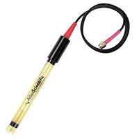

**Voltage Regulator**

1. L7805CV IC REG LINEAR 5V 1.5A TO220

    

    * $0.50/each
    * [link to product](https://www.digikey.com/en/products/detail/stmicroelectronics/L7805CV/585964)

    | Pros                                      | Cons                                                             |
    | ----------------------------------------- | ---------------------------------------------------------------- |
    | Inexpensive component                     | Limited to 1.5 Ampere output              |
    | Large operating temperature range         | Heats up quickly                   |
    | Meets through hole mount constraint of project |

1. LT323AT#PBF IC REG LINEAR 5V 3A TO220-3

    

    * $8.94/each
    * [Link to product](https://www.digikey.com/en/products/detail/analog-devices-inc/LT323AT-PBF/888959)

    | Pros                                                              | Cons                |
    | ----------------------------------------------------------------- | ------------------- |
    | Large output current                                             | Very expensive      |
    | Large operating temperature range                                 | Slow shipping speed |
    | 100% Burn-in Thermal Limit |

    1. LM1084IT-5.0/NOPB IC REG LINEAR 5V 5A TO220-3

    

    * $2.83/each
    * [Link to product](https://www.digikey.com/en/products/detail/texas-instruments/LM1084IT-5-0-NOPB/363556)

    | Pros                                                              | Cons                |
    | ----------------------------------------------------------------- | ------------------- |
    | Massive output current                                             | Slightly expensive      |
    | Low dropout voltage                                 | Poor load regulation in cold temperatures |
    | Current limiting and thermal protection |

**Choice:** Option 3: LM1084IT-5.0/NOPB IC REG LINEAR 5V 5A TO220-3

**Rationale:** The TI voltage regulator is more expensive, but has an output of 5 Amperes, ensuring the all components will have sufficient power. It's also cheaper than the LT323AT#PBF from Analog Devices Inc., despite having a larger current output.

**Operational Amplifier**

1. MCP6004-I/P IC OPAMP GP 4 CIRCUIT 14DIP

    

    * $0.59/each
    * [link to product](https://www.digikey.com/en/products/detail/microchip-technology/MCP6004-I-P/523060)

    | Pros                                      | Cons                                                             |
    | ----------------------------------------- | ---------------------------------------------------------------- |
    | Inexpensive component                     | Pins are hard to reposition              |
    | Multiple circuits available for use       | Takes up large space on PCB                   |
    | Small voltage swing |

1. MCP6004-E/P IC OPAMP GP 4 CIRCUIT 14DIP

    

    * $0.65/each
    * [Link to product](https://www.digikey.com/en/products/detail/microchip-technology/MCP6004-E-P/683200)

    | Pros                                                              | Cons                |
    | ----------------------------------------------------------------- | ------------------- |
    | Larger operating temperature range                                | Pins are hard to reposition      |
    | Also inexpensive, but not as much as MCP6004-I/P                  | Takes up large space on PCB |
    | Meets through hole mount constraints for project |

    1. MCP601-I/P IC OPAMP GP 1 CIRCUIT 8DIP

    

    * $0.62/each
    * [Link to product](https://www.digikey.com/en/products/detail/microchip-technology/MCP601-I-P/305930)

    | Pros                                                              | Cons                |
    | ----------------------------------------------------------------- | ------------------- |
    | Smaller IC                                             | Only 1 circuit available      |
    | Larger gain bandwidth                                 | Large noise voltage density below 20 Hz |
    | Slightly cheaper than MCP6004-E/P |

**Choice:** Option 3: MCP601-I/P

**Rationale:** The smaller volume and larger gain bandwidth make the MCP601-I/P much more suitable. The device doesn't need more than 1 operational amplifier and since all 3 choices are roughly the same price, the choice became clear.

**pH Probe**

1. ENV-30-PH CONSUMER GRADE PH PROBE

    

    * $49.99/each
    * [link to product](https://www.digikey.com/en/products/detail/atlas-scientific/ENV-30-PH/16003028)

    | Pros                                      | Cons                                                             |
    | ----------------------------------------- | ---------------------------------------------------------------- |
    | Inexpensive component                     | Additional $15 shipping fee              |
    | Short shipping time       | Range of 2-13                   |
    | Accurate to + or - 0.1 pH | Can never be dry

1. ENV-45-PH SPEAR TIP PH PROBE

    

    * $169.99/each
    * [Link to product](https://www.digikey.com/en/products/detail/atlas-scientific/ENV-45-PH/16003101)

    | Pros                                                              | Cons                |
    | ----------------------------------------------------------------- | ------------------- |
    | Reads from 0-14 pH                             | Extremely expensive      |
    | Life expectancy of 2.5+ years                  | Most likely will require monthly recalibration |
    | Max pressure of 100 psi |

    1. ENV-40-PH LAB GRADE PH PROBE

    

    * $84.99/each
    * [Link to product](https://www.digikey.com/en/products/detail/atlas-scientific/ENV-40-PH/16003032)

    | Pros                                                              | Cons                |
    | ----------------------------------------------------------------- | ------------------- |
    | Accurate to + or - 0.002 pH                          | Very expensive      |
    | Much stronger output current                         | Most likely will require monthly recalibration |
    | Hydrogen amplification leads to less noise and more stable readings |

**Choice:** Option 1: ENV-30-PH

**Rationale:** Since this device will primarily be used to tell consumers if their water is safe to drink or not, they will not need super accurate pH readings. While the ENV-40-PH and ENV-45-PH are clearly higher quality, their higher costs make the ENV-30-PH the clear choice.

**Coaxial Connector**

1. RF2-04A-T-00-50-G CONN SMA JACK STR 50 OHM PCB

    

    * $1.70/each
    * [link to product](https://www.digikey.com/en/products/detail/adam-tech/RF2-04A-T-00-50-G/9830588)

    | Pros                                      | Cons                                                             |
    | ----------------------------------------- | ---------------------------------------------------------------- |
    | Inexpensive component                     | Long shipping time              |
    | Meets through hole mount project constraint       | Lower max frequency        |

1. RFPC-SMA28-F SMA VERTICAL PCB JACK

    

    * $1.73/each
    * [Link to product](https://www.digikey.com/en/products/detail/gct/RFPC-SMA28-F/22162141)

    | Pros                                                              | Cons                |
    | ----------------------------------------------------------------- | ------------------- |
    | Inexpensive component                          | Lower max frequency      |
    | Meets through hole mount project constraint    | 50 ohm impedance |
    | Shorter shipping time |

    1. SMA-J-P-H-ST-TH1 CONN SMA JACK STR 50 OHM PCB

    

    * $2.67/each
    * [Link to product](https://www.digikey.com/en/products/detail/samtec-inc/SMA-J-P-H-ST-TH1/2345104)

    | Pros                                                              | Cons                |
    | ----------------------------------------------------------------- | ------------------- |
    | Higher max frequency                          | Slightly more expensive      |
    | Larger operating temperature range            | Fewer threads to fasten to |
    | Shortest shipping time |

**Choice:** Option 3: SMA-J-P-H-ST-TH1

**Rationale:** Coaxial connectors aren't very different from each other and while the device probably won't come close to 20 GHz, it's nice to have better electrical ratings. This connector is slightly more expensive, but by less than a dollar compared to the other connectors. It will also arrive the fastest compared to the others.