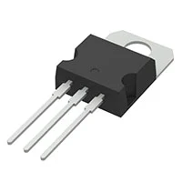
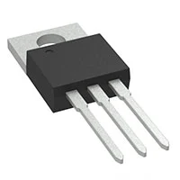

**Voltage Regulator**

1. L7805CV IC REG LINEAR 5V 1.5A TO220

    

    * $0.50/each
    * [link to product](https://www.digikey.com/en/products/detail/stmicroelectronics/L7805CV/585964)

    | Pros                                      | Cons                                                             |
    | ----------------------------------------- | ---------------------------------------------------------------- |
    | Inexpensive                               | Limited to 1.5 Ampere output              |
    | Large operating temperature range         | Heats up quickly                   |
    | Meets through hole mount constraint of project |

1. LT323AT#PBF IC REG LINEAR 5V 3A TO220-3

    

    * $8.94/each
    * [Link to product](https://www.digikey.com/en/products/detail/analog-devices-inc/LT323AT-PBF/888959)

    | Pros                                                              | Cons                |
    | ----------------------------------------------------------------- | ------------------- |
    | Large output current                                             | Very expensive      |
    | Large operating temperature range                                 | Slow shipping speed |
    | 100% Burn-in Thermal Limit |

    1. LM1084IT-5.0/NOPB IC REG LINEAR 5V 5A TO220-3

    

    * $2.83/each
    * [Link to product](https://www.digikey.com/en/products/detail/texas-instruments/LM1084IT-5-0-NOPB/363556)

    | Pros                                                              | Cons                |
    | ----------------------------------------------------------------- | ------------------- |
    | Massive output current                                             | More expensive      |
    | Low dropout voltage                                 | Poor load regulation in cold temperatures |
    | Current limiting and thermal protection |

**Choice:** Option 3: LM1084IT-5.0/NOPB IC REG LINEAR 5V 5A TO220-3

**Rationale:** The TI voltage regulator is more expensive, but has an output of 5 Amperes, ensuring the all components will have sufficient power. It's also cheaper than the LT323AT#PBF from Analog Devices Inc., despite having a larger current output.
