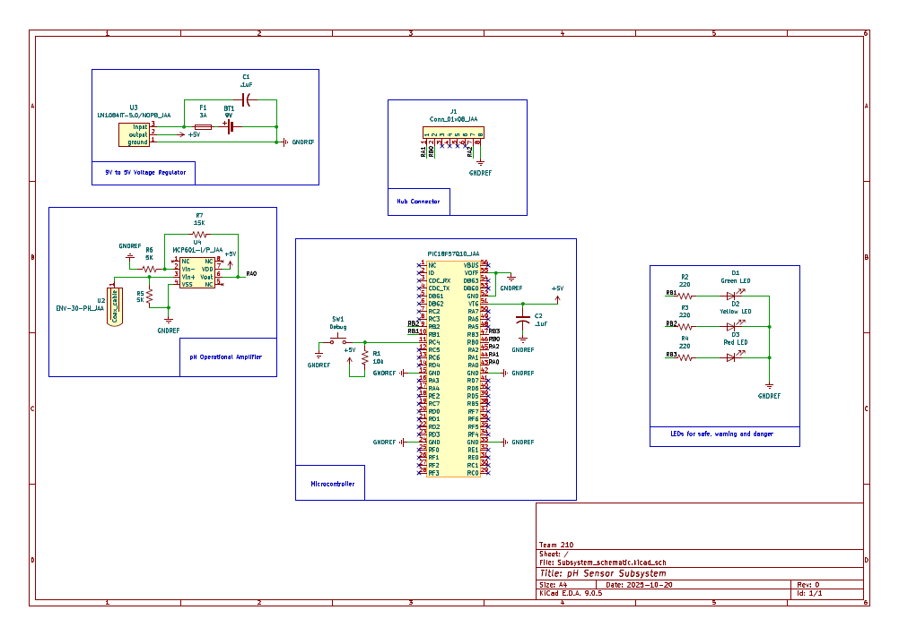

## Overview

The schematic shown in Figure 1 is designed to support Team 210 and our water quality device.

{style width:"350" height:"300;"}
**Figure 1:** pH Sensor Subsystem

## Resouces

The schematic as a PDF download is available [*here*](docs/04-Schematic/Sensor_schematic), and the Zip folder of the project [*here*](docs/04-Schematic/schematic_zip).