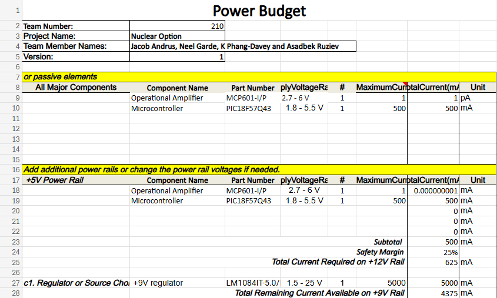

## Overview
The only components that need a power supply are the microcontroller and operational amplifier. The voltage regulator will take the 9 volts from the battery and regulate it to 5 volts.

{style width:"350" height:"300;"}

## Conclusions

The power budget is very limited, due to the fact that not many components require some kind of external power source. The majority of this subsystem depends on an analog measurement being amplified to provide the user with an idea as to the pH of some water.

## Resouces

The power budget as a PDF download is available [*here*](c:\Users\User\Downloads\Power_Budget.pdf).