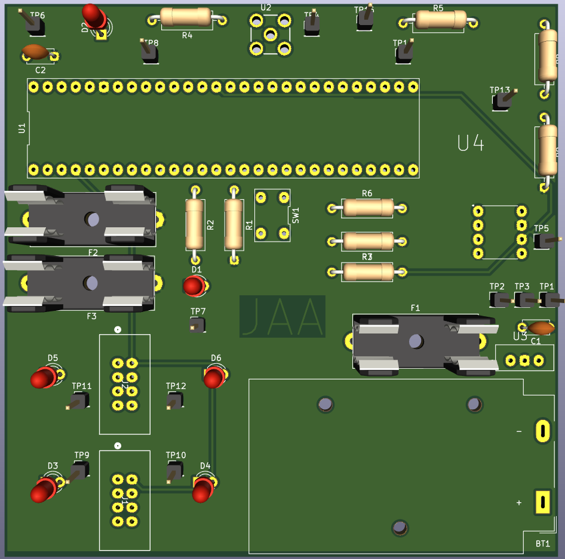

title: PCB design
---

## Overview
This is a manufacturable PCB for Peralta Labs to create the pH sensor board.

Front layer of PCB

Back layer of PCB

3D image of PCB

## Resouces

The KiCAD project folder is available [*here*](Subsystemschematic(2).zip).
The gerber files for the PCB are available [*here*](Subsystem PCB Design (Jacob).zip).
PCB image files are available as PNGs [*here*](PCB_images.zip).
